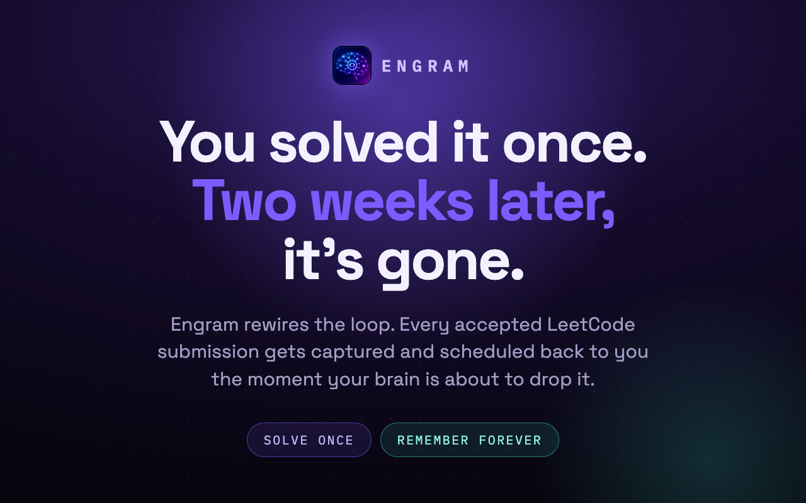
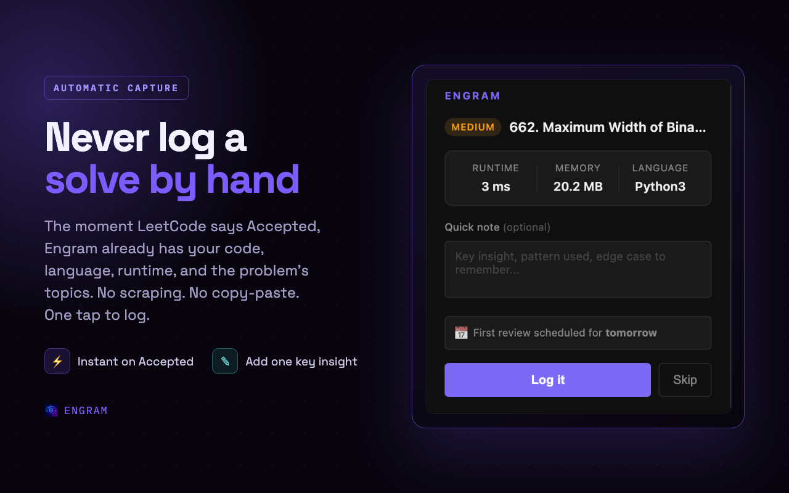
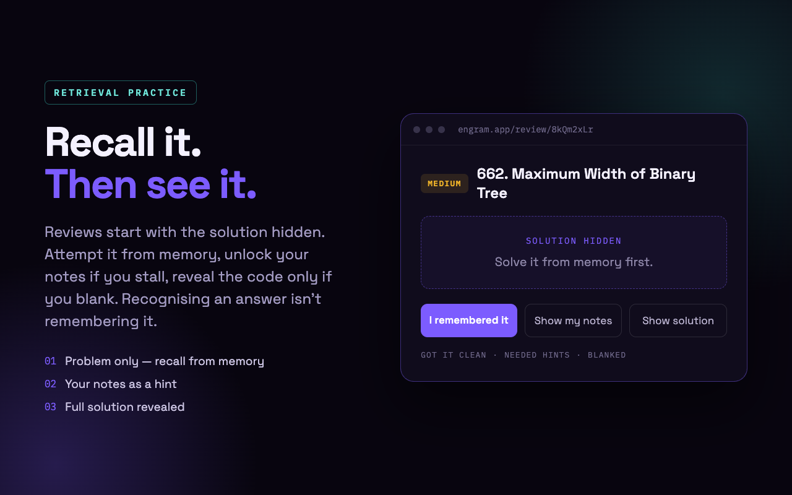
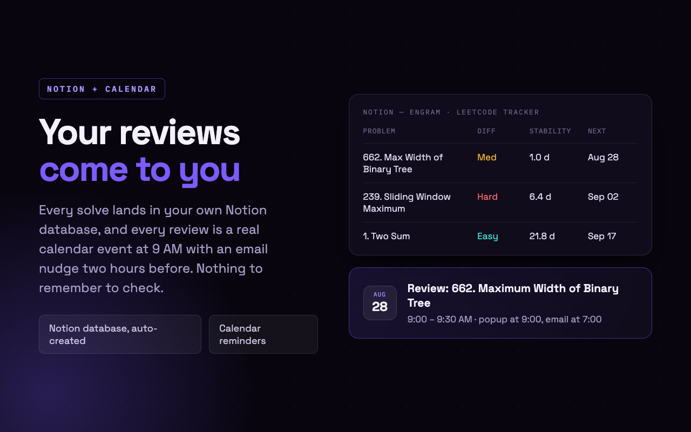
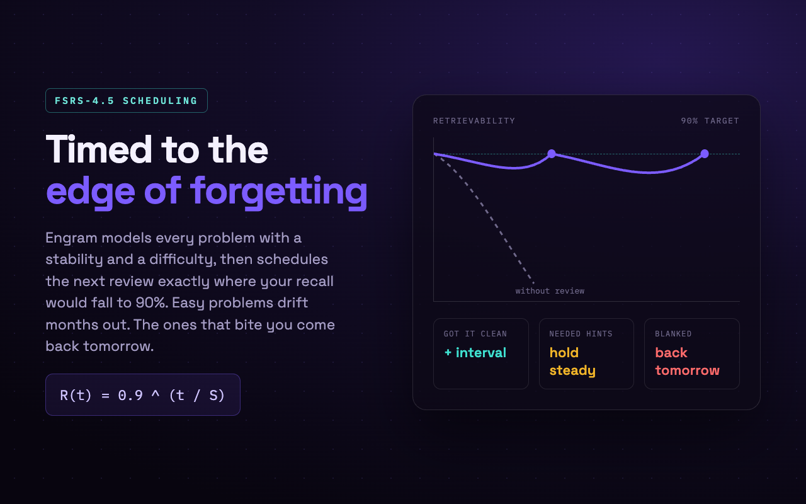

# Engram



Automatic spaced repetition for LeetCode. Solve once, remember forever.

Engram is a Chrome extension + Node.js backend that captures every accepted LeetCode submission and schedules memory reviews using the FSRS-4.5 algorithm — the most accurate open-source spaced repetition system available. Reviews are retrieval-based: the solution is hidden until you attempt recall, so each session actually strengthens memory instead of just recognizing a familiar answer.

---



## How it works — end to end

```
LeetCode tab                  Extension                      Backend (Node.js)
─────────────────             ──────────────────────         ──────────────────────────
User submits code
      │
      ▼
page-interceptor.js           
intercepts window.fetch       
  · POST /submit/ → code      
  · GET /check/ → verdict     
      │
      ▼ window.postMessage
bridge.js (isolated world)
  · fetches problem meta
    from LeetCode GraphQL      
      │
      ▼ chrome.runtime.sendMessage
service-worker.js
  · stores pendingSubmission
  · fires chrome notification
      │
      ▼ (user opens popup)
popup.js
  · user adds optional note
  · clicks Log
      │
      ▼ POST /api/submissions ──────────────────────────────▶ submissions.js
                                                              · saves to Supabase
                                                              · creates Notion page
                                                              · creates Calendar event
                                                              · returns { notionSynced }
      ◀────────────────────────────────────────────────────── 201 { ok, notionSynced }
popup shows success or
amber warning if Notion failed
```

---

## System architecture

### Chrome Extension

```
extension/
├── manifest.json
├── content/
│   ├── page-interceptor.js   MAIN world — patches window.fetch
│   └── bridge.js             ISOLATED world — bridges page → service worker
├── background/
│   └── service-worker.js     Event hub: stores pending, fires notifications
├── popup/
│   ├── popup.html / .css / .js   Log screen shown after a solve
└── options/
    ├── options.html / .css / .js  Auth + integration settings
```

**Two-world content script design**

LeetCode runs in the page's JavaScript context. To intercept its `fetch` calls, `page-interceptor.js` runs in `MAIN` world and monkey-patches `window.fetch`. It cannot access Chrome APIs from here.

`bridge.js` runs in `ISOLATED` world (Chrome extension context) and has access to `chrome.runtime`. These two scripts communicate via `window.postMessage` — the only channel that crosses the world boundary.

```
page-interceptor.js  →  postMessage(ENGRAM_CODE_CAPTURED)      →  bridge.js
page-interceptor.js  →  postMessage(ENGRAM_SUBMISSION_ACCEPTED) →  bridge.js
bridge.js            →  chrome.runtime.sendMessage              →  service-worker.js
```

**What each content script captures**

- `POST /problems/{slug}/submit/` — the request body contains the submitted code and language
- `GET /submissions/detail/{id}/v2/check/` — the response contains verdict, runtime, memory stats

Both are intercepted without any polling or scraping. The extension waits for LeetCode's own network calls and reads their payloads.

**Problem metadata**

After a submission is accepted, `bridge.js` calls the LeetCode GraphQL API (`/graphql`) from the same origin (no CORS issue) to fetch the problem number, title, difficulty, and topic tags — data not present in the submission response.

---

### Backend

```
backend/src/
├── index.js                  Express app, route registration
├── middleware/
│   └── auth.js               JWT verification (requireAuth)
├── routes/
│   ├── auth.js               POST /api/auth/signup, /login
│   ├── submissions.js        POST /api/submissions
│   ├── reviews.js            GET  /review/:token  (review page)
│   │                         POST /api/reviews/:token/complete
│   └── integrations.js       Notion + Google OAuth flows, /status
├── services/
│   ├── sr.js                 FSRS-4.5 algorithm
│   ├── notion.js             Notion API: createDatabase, createProblemPage, updateReviewState
│   └── calendar.js           Google Calendar API: createReviewEvent, refreshAccessToken
└── db/
    └── client.js             Supabase client (service role)
```

**Submission flow (`POST /api/submissions`)**

1. Fetch user's Notion token + calendar credentials from `user_integrations`
2. Create a Notion page with problem data, code, notes, and initial FSRS state
3. Insert a row into the `problems` table with `stability = 1.0`, `memory_difficulty = 7.2102`
4. Insert a row into the `reviews` table with a `nanoid(12)` review token, scheduled for `date_solved + 1 day`
5. Create a Google Calendar event at 9 AM on the review date, with a popup reminder at the time and an email reminder 2 hours before
6. Return `{ ok, notionSynced, notionError }` — Notion failure never blocks the Supabase save

**Review flow (`GET /review/:token` + `POST /api/reviews/:token/complete`)**

The review page is server-rendered HTML with a three-phase JavaScript state machine:

- **Phase 1 (recall)** — problem title, difficulty, and LeetCode link only. User attempts the problem from memory.
- **Phase 2 (hint)** — user's saved notes are revealed. Pre-selects "Needed hints" rating.
- **Phase 3 (solution)** — full submitted code is revealed. Pre-selects "Blanked" rating.
- Clicking "I remembered it" skips directly to the rating section and pre-selects "Got it clean".

On submit, the server:
1. Computes `elapsedDays` since the last review
2. Runs FSRS to get new `stability`, `difficulty`, and `nextReviewDate`
3. Updates `problems` with the new FSRS state
4. Marks the review complete
5. Creates the next `reviews` row and schedules the next Calendar event

---

### FSRS-4.5 Algorithm

FSRS (Free Spaced Repetition Scheduler) models memory with two variables per problem:

| Variable | Meaning |
|---|---|
| **Stability (S)** | Days until retrievability drops to 90% |
| **Difficulty (D)** | Inherent card difficulty, 1.0 (easiest) to 10.0 (hardest) |

**Forgetting curve**

```
R(t) = 0.9 ^ (t / S)
```

Where `t` is days elapsed and `S` is current stability. The next review is scheduled at `t = S` to keep retention at 90%.

**On successful recall**

```
S_new = S × (e^w8 × (11 − D) × S^(−w9) × (e^(w10 × (1−R)) − 1) × multiplier + 1)
```

Stability grows — harder cards gain less, easier cards gain more. `multiplier` is `w15 = 0.25` for "hard" and `w16 = 2.99` for "easy".

**On forgetting (rating = "again")**

```
S_new = w11 × D^(−w12) × (S+1)^w13 × e^(w14 × (1−R))
```

Stability is reset to a low value. The formula preserves some memory of past stability so recovery is faster than starting fresh.

**Difficulty update**

```
D_new = clamp(w6 × w4 + (1 − w6) × (D − w5 × (rating − 3)), 1, 10)
```

Difficulty adjusts after every review and mean-reverts toward `w4 = 7.21` to prevent drift to extremes.

**Initial state**

Every new problem starts at `S = 1.0` (review in 1 day) and `D = 7.2102` (mean difficulty).

**Rating mapping**

| UI button | FSRS rating | Meaning |
|---|---|---|
| Got it clean | good | Recalled without any hints |
| Needed hints | hard | Needed to see notes first |
| Blanked | again | Had to see the full solution |

---

### Database schema (Supabase / Postgres)

**`users`** — email, bcrypt password hash, created_at

**`problems`** — one row per solved problem per user
- Problem metadata: `problem_number`, `problem_title`, `title_slug`, `difficulty`, `topics`, `lang`, `code`, `notes`
- Performance: `runtime`, `memory`, `runtime_percentile`, `memory_percentile`
- FSRS state: `stability`, `memory_difficulty`, `last_review_date`, `next_review_date`
- Integration refs: `notion_page_id`

**`reviews`** — one row per scheduled review
- `review_token` — `nanoid(12)` used as the URL token for the review page
- `scheduled_date`, `completed_date`, `recall_quality`
- `next_interval_days` — the interval FSRS computed at completion
- `calendar_event_id` — Google Calendar event ID for this review

**`user_integrations`** — one row per user
- Notion: `notion_token`, `notion_database_id`
- Google: `google_access_token`, `google_refresh_token`, `calendar_id`

---



### Notion integration

On first connect, Engram creates a single database in the user's Notion workspace called "Engram — LeetCode Tracker" with columns for problem metadata, code, notes, stability, next review date, and review count.

On reconnect (token rotation), the backend runs a three-step lookup to avoid creating duplicate databases:
1. Check the stored `notion_database_id` in Supabase — verify it's still accessible with the new token
2. Search the workspace via `POST /search` for a database named "Engram — LeetCode Tracker"
3. Create a new database only if both above fail

---



### Google Calendar integration

Review events are created as timed events (9:00–9:30 AM) using the user's calendar timezone, fetched via `GET /calendars/{id}`. Reminders:
- Popup notification at 9:00 AM (0 minutes before)
- Email reminder at 7:00 AM (120 minutes before)

Google tokens are refreshed automatically on 401 errors using the stored `refresh_token`.

---



## Tech stack

| Layer | Technology |
|---|---|
| Chrome extension | Manifest V3, vanilla JS |
| Backend | Node.js, Express |
| Database | Supabase (Postgres) |
| Auth | bcrypt + JWT |
| Spaced repetition | FSRS-4.5 (custom implementation) |
| Notion sync | Notion API v2022-06-28 |
| Calendar | Google Calendar API v3 |
| Hosting | Render |

---

## Local development

**Backend**

```bash
cd backend
npm install
cp .env.example .env   # fill in your values
node src/index.js
```

Required environment variables:

```
SUPABASE_URL
SUPABASE_SERVICE_ROLE_KEY
JWT_SECRET
NOTION_CLIENT_ID
NOTION_CLIENT_SECRET
NOTION_REDIRECT_URI
GOOGLE_CLIENT_ID
GOOGLE_CLIENT_SECRET
GOOGLE_REDIRECT_URI
APP_URL
PORT
```

**Extension**

1. Open `chrome://extensions`
2. Enable Developer mode
3. Click "Load unpacked" → select the `extension/` folder

---

## Privacy

Engram collects only what's needed to run the spaced repetition system: your email address and your LeetCode submission data. No analytics, no telemetry, no browsing history.

Full policy: [PRIVACY.md](PRIVACY.md)
